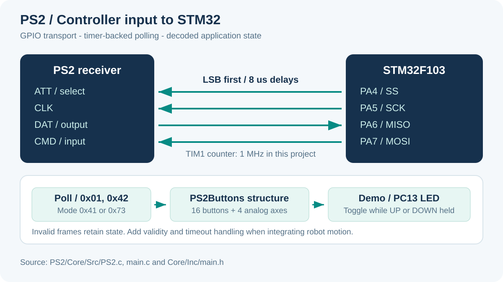

# PS2 Controller for Robots

A GPIO-based PS2 controller driver and STM32F103 demo. It reads sixteen buttons and four analog axes into a `PS2Buttons` structure, with a timer-backed software serial interface.

[English](#english) | [Tiếng Việt](#tieng-viet)



<a id="english"></a>

## What the project does

- Sends and receives bytes LSB first using GPIO rather than hardware SPI.
- Starts a timer for microsecond delays.
- Requests analog mode during initialization.
- Decodes active-low button bits into `1 = pressed` fields.
- Accepts digital mode `0x41` and analog mode `0x73`.
- Demonstrates input by toggling PC13 while UP or DOWN is held.

The demo supplies controller input. It does not include a robot drivetrain, motor commands or a connection-loss stop policy.

## Repository map

| Path | Purpose |
| --- | --- |
| [PS2/Core/Inc/PS2.h](PS2/Core/Inc/PS2.h) | Structure and public function declarations |
| [PS2/Core/Src/PS2.c](PS2/Core/Src/PS2.c) | Bit-bang transport, configuration commands and decoding |
| [PS2/Core/Src/main.c](PS2/Core/Src/main.c) | Initialization and LED demonstration |
| [PS2/Core/Inc/main.h](PS2/Core/Inc/main.h) | GPIO aliases consumed by the driver |
| [PS2/PS2.ioc](PS2/PS2.ioc) | CubeMX peripheral configuration |
| `PS2/.project`, `PS2/.cproject` | STM32CubeIDE import metadata |

The GPIO names resemble SPI signals, but this project does not initialize a hardware SPI peripheral.

## Wiring

| PS2 receiver signal | STM32 pin | Alias in `main.h` |
| --- | --- | --- |
| ATT / select | PA4 | `SS` |
| CLK | PA5 | `SCK` |
| DAT / receiver output | PA6 | `MISO` |
| CMD / receiver input | PA7 | `MOSI` |
| Ground | GND | Common reference |
| Power | Check receiver board requirements | Match the board's supply and logic interface |

Verify the receiver's connector order and power specification rather than assuming all wireless receiver boards use the same pin layout. STM32 input signals must use compatible logic levels.

The code configures DAT as an input with **no internal pull-up**. Check whether your receiver or adapter provides the required pull-up; add appropriate external bias if the receiver documentation requires it.

PC13 is the demo output. LED polarity depends on the board.

## Timing and protocol behavior

TIM1 uses prescaler 71 and period 65535. With the project's 72 MHz timer clock, its counter advances once per microsecond.

`PS2_SendByte()`:

1. Places the command bit on MOSI.
2. Drives clock high, waits 8 counter ticks, then drives it low.
3. Waits another 8 ticks, drives clock high and samples MISO.
4. Repeats for the next bit, beginning with bit 0.

GPIO and function overhead add to the requested delays. The repository does not include a measured bus frequency or validated polling-rate benchmark.

Initialization runs: POLL, enter config, request analog mode, POLL, exit config. Updates transmit nine bytes starting with `0x01, 0x42`.

| Received byte | Meaning in the driver |
| --- | --- |
| 1 | Mode: `0x41` digital or `0x73` analog |
| 3 and 4 | Sixteen active-low buttons |
| 5 and 6 | Right X and Y, analog mode only |
| 7 and 8 | Left X and Y, analog mode only |

The driver checks the mode byte. It does not expose a validity result, check an ACK signal or confirm that analog-mode configuration succeeded.

## Build and try the demo

1. Clone:
   ```bash
   git clone https://github.com/TuanLinh05/PS2-Controller-for-Robot.git
   cd PS2-Controller-for-Robot
   ```
2. Import `PS2/` as an existing project in STM32CubeIDE.
3. Confirm your STM32 target, oscillator and receiver wiring.
4. Build and program the project with the matching SWD configuration.
5. Power and pair the controller according to the receiver's instructions.
6. Observe PC13 or watch the `PS2` structure in a debug session.

While UP is true, the LED is toggled on every loop. DOWN is handled by another independent condition. This is not a single toggle per press; holding a button can cause rapid toggling. The loop adds a 2 ms delay after the polling transaction.

## Driver API

| Function | Role |
| --- | --- |
| `PS2_Init(timer, state)` | Stores pointers, starts timer and sends configuration sequence |
| `PS2_Update()` | Polls and updates buttons, then analog axes if mode is `0x73` |
| `PS2_Poll()` | Sends a short poll without updating the public structure |
| `PS2_EnterConfig()`, `PS2_AnalogMode()`, `PS2_ExitConfig()` | Configuration commands |
| `PS2_Cmd()`, `PS2_SendByte()` | Low-level transaction and byte transport |

The driver uses global pointers internally and supports one timer/state pair at a time. Keep the supplied timer and structure alive throughout its use.

### Integration example

After the HAL clock, GPIO and TIM1 initialization:

```c
#include "PS2.h"

PS2Buttons controller = {0};

/* Call once after MX_GPIO_Init() and MX_TIM1_Init(). */
PS2_Init(&htim1, &controller);

/* Call repeatedly in the application's main loop. */
PS2_Update();
if (controller.CROSS) {
    /* Handle the requested action in your application. */
}
int16_t left_y = 128 - (int16_t)controller.LY;
HAL_Delay(2);
```

The `left_y` expression is an illustrative mapping; verify the neutral value, direction and dead zone with your controller before using analog values for motion.

Buttons: `SELECT, L3, R3, START, UP, RIGHT, DOWN, LEFT, L2, R2, L1, R1, TRIANGLE, CIRCLE, CROSS, SQUARE`.

Axes: `RX, RY, LX, LY`, stored as bytes from 0 to 255.

## Porting and input freshness

Copy `PS2.c` and `PS2.h` into your STM32 HAL project, then provide:

- GPIO aliases `SS`, `SCK`, `MISO` and `MOSI`, including their `_Pin` and `_GPIO_Port` definitions.
- Output GPIO configuration for select, clock and command; input configuration for data.
- A running counter whose tick duration matches the driver's delay assumptions.
- A persistent, initialized `PS2Buttons` structure.

When the mode byte is invalid, `PS2_Update()` returns without clearing previous values. In digital mode, buttons update but axes retain their old values. Therefore the public structure alone does not prove that input is fresh.

Before connecting this input to robot motion, add application-level validity and timeout handling so old button or axis values cannot continue driving an actuator after a lost connection.

## Troubleshooting

| Observation | Check |
| --- | --- |
| No button changes | Receiver pairing, power, common ground, DAT/CMD direction |
| Mode is invalid | Wiring, DAT bias, clock timing and receiver compatibility |
| Buttons work but axes do not | Received mode byte; analog request may not have succeeded |
| LED looks continuously lit | Held-button toggling at the loop rate |
| Old input persists after disconnect | Driver's retained state and application timeout policy |

<a id="tieng-viet"></a>

## Hướng dẫn tiếng Việt

### Chức năng

Driver đọc tay cầm PS2 bằng GPIO, truyền LSB trước và dùng TIM1 tạo delay. Kết quả gồm 16 nút (`1 = đang nhấn`) và bốn trục analog trong struct `PS2Buttons`.

Repo chỉ có demo đầu vào và LED PC13; chưa có điều khiển động cơ hay chính sách dừng khi mất kết nối.

### Nối dây và chạy thử

1. ATT/CS vào **PA4**, CLK vào **PA5**, DAT vào **PA6**, CMD vào **PA7**.
2. Kiểm tra sơ đồ chân, nguồn và mức logic của receiver; nối chung GND.
3. DAT hiện không có pull-up nội trong cấu hình, cần kiểm tra điện trở kéo lên trên mạch thực tế.
4. Import `PS2/` bằng STM32CubeIDE, kiểm tra target và clock rồi build, nạp qua SWD.
5. Ghép nối tay cầm; theo dõi struct `PS2` bằng debugger.
6. UP hoặc DOWN làm PC13 đảo trạng thái liên tục khi giữ nút, không phải một lần mỗi lần nhấn.

### Ghép vào robot

- Gọi `PS2_Init(&htim1, &controller)` một lần sau khi khởi tạo GPIO và timer.
- Gọi `PS2_Update()` trong vòng lặp; khai báo struct và timer tồn tại lâu dài.
- TIM1 hiện dùng counter 1 MHz với clock 72 MHz. Nếu đổi clock, phải kiểm tra lại delay.
- Mode `0x41` chỉ cập nhật nút; mode `0x73` cập nhật thêm analog.
- Gói không hợp lệ giữ nguyên giá trị cũ, nên cần bổ sung kiểm tra hợp lệ và timeout trước khi điều khiển chuyển động.
- Đo lại điểm giữa, chiều trục và dead zone cho tay cầm của bạn.

## Credits

Repository maintained by [Vu Tuan Linh](https://github.com/TuanLinh05), HCMUT. The `PS2.c` and `PS2.h` headers retain the original **Author: 27504** attribution and creation date, 23 April 2022. STM32 HAL and CMSIS retain their component notices and licenses.
